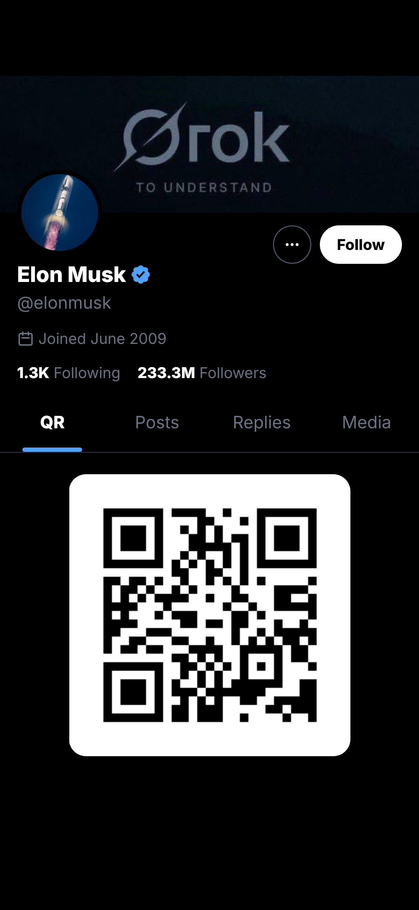

<div align="center">
  <h1>xQR</h1>
  <h3>QR Code Generator for X Profiles</h3>
  <p>Generate beautiful QR codes that link to any X (Twitter) profile</p>

  <p>
    <a href="LICENSE"></a>
    <a href="https://github.com/stevederico/xqr/issues"></a>
    
  </p>
</div>

<br />

## Demo

<div align="center">
  
</div>

<br />

Visit the app and enter any X username to see it in action!

<br />

## What it does

xQR creates shareable QR codes for X profiles. Enter a username and get a scannable QR code displayed on a profile card that looks just like the X app - complete with banner, avatar, bio, follower counts, and more.

**Use cases:**
- Conference name badges
- Phone lock screens for networking
- Business cards
- Event check-ins

<br />

## Features

- **X API Integration** - Fetches real profile data (avatar, banner, bio, location, follower counts)
- **X-Style Profile UI** - Looks like the native X app
- **Display URLs** - Shows friendly URLs instead of t.co links
- **Direct URL Access** - Go to `/username` for instant QR (e.g., `localhost:5173/elonmusk`)
- **Mobile Optimized** - Full-screen display for screenshots

<br />

## Tech Stack

| Technology | Purpose |
|------------|---------|
| React 19 | UI Framework |
| Vite 7.1+ | Build Tool |
| Tailwind CSS 4 | Styling |
| Hono 4 | Backend |
| @xdevplatform/xdk | X API SDK |

<br />

## Setup

1. **Install dependencies**
   ```bash
   npm install
   npm install --workspace=backend
   ```

2. **Configure X API**

   Get a Bearer Token from the [X Developer Portal](https://developer.x.com/en/portal/dashboard)

   Copy the example environment file and add your credentials:
   ```bash
   cp backend/.env.example backend/.env
   ```

   Edit `backend/.env` with your values:
   ```bash
   X_BEARER_TOKEN=your_bearer_token_here
   JWT_SECRET=any_random_string  # Generate with: openssl rand -base64 32
   ```

3. **Run**
   ```bash
   npm run start
   ```

   App runs at `http://localhost:5173`

<br />

## Usage

1. Enter an X username (e.g., `elonmusk`)
2. View the generated profile card with QR code
3. Screenshot for your lock screen or share

Or go directly to: `localhost:5173/username`

<br />

## API Endpoint

```
GET /user/:username
```

Returns X profile data:
```json
{
  "id": "123456",
  "username": "elonmusk",
  "name": "Elon Musk",
  "profile_image_url": "https://...",
  "profile_banner_url": "https://...",
  "description": "Bio text...",
  "location": "Mars",
  "display_url": "x.ai",
  "followers_count": 200000000,
  "following_count": 800,
  "verified": true
}
```

<br />

## Troubleshooting

**"Failed to fetch profile"**
- Verify your `X_BEARER_TOKEN` is valid in `backend/.env`
- Check that the username exists on X
- Ensure backend is running on port 8000

**Backend won't start**
- Make sure all dependencies are installed: `npm install --workspace=backend`
- Check that port 8000 is available
- Verify `.env` file exists in backend directory

**API rate limits**
- X API has rate limits per bearer token
- Free tier: 500 requests per month
- Consider implementing caching if needed

<br />

## Contributing

Contributions are welcome! Feel free to open issues or submit pull requests.

<br />

## License

MIT License - see [LICENSE](LICENSE) file for details

<br />

## Support

- [Open an issue](https://github.com/stevederico/xqr/issues) for bug reports or feature requests
- Check [existing issues](https://github.com/stevederico/xqr/issues) before creating a new one

<br />

---

<div align="center">
  Made with ❤️ for the X community
</div>
